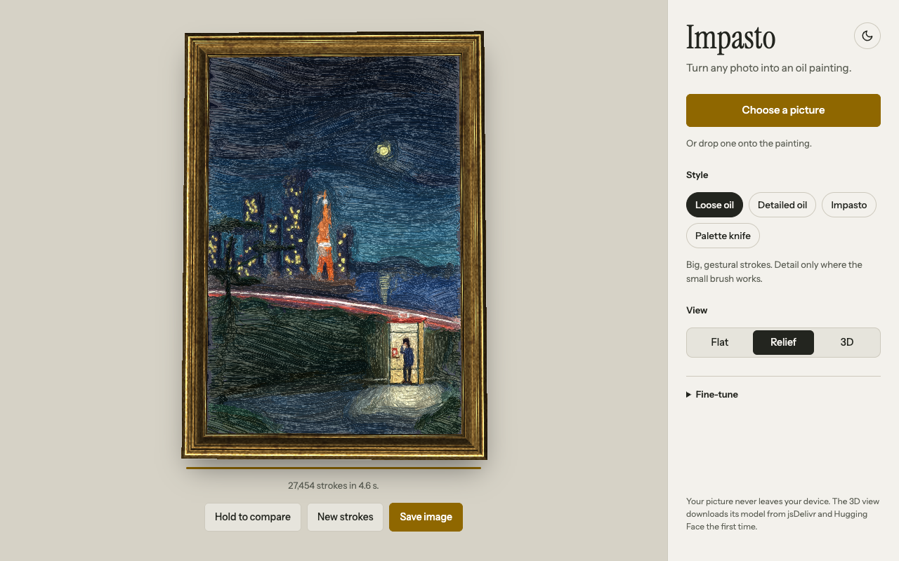

# Impasto

Turn any photo into an oil painting you can tilt in the light. Runs entirely in the browser.

**[Try it →](https://mrmammadov.github.io/impasto/)**



## What it does

- **Paints stroke by stroke.** Big brushes block in the picture, then smaller ones add detail where it matters. Four styles: loose oil, detailed oil, impasto and palette knife.
- **Relief.** Every stroke also lays down paint thickness, so ridges catch a moving light and grooves fall into shadow, in a lit gold frame.
- **3D.** Depth is estimated from the photo, and the scene shifts as you move, like looking through a window.
- **Private.** Your picture never leaves your device. The only outside download is the 3D model, fetched once when you first turn 3D on.

Moving the pointer over the painting moves the light. On phones, tilting the phone does.

## How it works

| Piece    | What happens                                                                                                                                                                                                                                                                            |
| -------- | --------------------------------------------------------------------------------------------------------------------------------------------------------------------------------------------------------------------------------------------------------------------------------------- |
| Painting | A coarse-to-fine stroke painter ([Hertzmann, 1998](https://mrl.cs.nyu.edu/publications/painterly98/hertzmann-siggraph98.pdf)): each layer places strokes only where the canvas still differs from the photo, following the picture's contours.                                          |
| Relief   | While painting, every mark is repeated in grey on a hidden height map. A WebGL shader turns it into surface normals and lights them from the pointer's direction.                                                                                                                       |
| 3D       | [Depth Anything V2](https://huggingface.co/onnx-community/depth-anything-v2-small) runs in the browser via [Transformers.js](https://huggingface.co/docs/transformers.js) (WebGPU, with a CPU fallback). The shader ray-marches the depth map so near things stay in front of far ones. |

## Getting started

Requires Node 20 or later.

```sh
npm install
npm run dev      # http://localhost:5173
```

| Script             | Does                                                                                                             |
| ------------------ | ---------------------------------------------------------------------------------------------------------------- |
| `npm run build`    | Writes `dist/index.html`, one self-contained file (also opens with a double-click)                               |
| `npm test`         | Unit tests (Node's built-in runner)                                                                              |
| `npm run test:e2e` | Browser tests with Playwright, against the build. Locally: `PW_CHANNEL=chrome npm run test:e2e` uses your Chrome |
| `npm run check`    | Lint, formatting, types, unit tests and build: what CI runs before the browser tests                             |

## Project layout

```
index.html, styles.css   the page
src/
  main.js                UI wiring
  painter.js             where strokes go and which colour they carry
  styles/                how strokes look: oil.js, knife.js (register new ones in index.js)
  presets.js             the Style choices (plain data)
  height.js              records paint thickness while painting
  viewer.js              WebGL view: relief lighting, gold frame, 3D parallax
  depth.js               3D depth estimation, loaded on first use (versions pinned)
  tilt.js                pointer, gyroscope and idle motion
  image-ops.js           blur, gradients, seeded randomness
test/unit, test/e2e      unit and browser tests
build.mjs                the single-file build
```

## Adding a style

1. Create `src/styles/mystyle.js` exporting a `BrushStyle` (see `src/types.js`). `render(ctx, stroke, env)` draws one stroke; the optional `finish` and `ground` hooks handle surface texture and underpainting.
2. Register it in `src/styles/index.js`.
3. Add a preset to `src/presets.js` that uses it. It appears in the UI automatically, and relief works without extra code.

## Browser support

Current Chrome, Edge, Safari and Firefox. 3D is fastest with WebGPU (Chrome, Edge, Safari 26+) and falls back to the CPU elsewhere. Without WebGL the app shows the flat painting only.

## Deployment

Pushes to `main` run CI (`.github/workflows/ci.yml`). When it passes, `deploy.yml` publishes `dist/` to GitHub Pages. In the repository settings, set **Pages → Source** to **GitHub Actions**.

## License

[Apache 2.0](LICENSE). Fonts: Instrument Sans and Instrument Serif, [SIL Open Font License](assets/fonts/OFL.txt).
